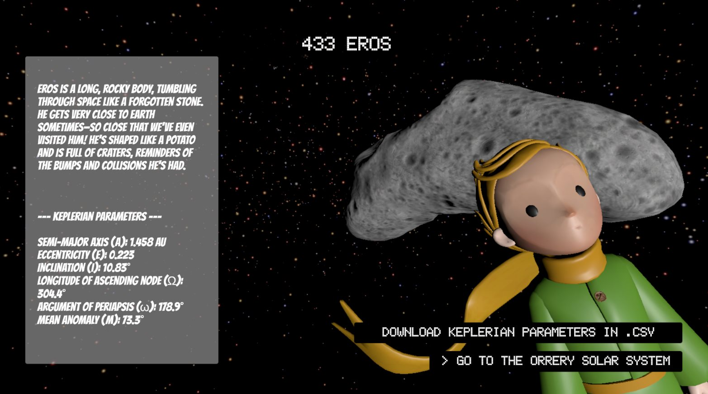

# Space Apps Challenge: Create an Orrery Web App 🌌🚀

- **Our App: [www.effoma.com/nasa](www.effoma.com/nasa)**
- **Our Video Demo: [https://youtu.be/4CBwFxsVA9A](https://youtu.be/4CBwFxsVA9A)**
- **Our Slides: [https://drive.google.com/file/d/1gKrMhTSZ39-aVSIV2pnFBgl9sfdFJELs/view?usp=sharing](https://drive.google.com/file/d/1gKrMhTSZ39-aVSIV2pnFBgl9sfdFJELs/view?usp=sharing)**

## Project Overview

This project, developed by **Team SkyNext**, is part of the **2024 NASA Space Apps Challenge**. Our mission was to create an interactive orrery web application that visually represents celestial bodies. The goal is to offer an engaging and educational tool that helps users explore the solar system and learn more about the fascinating objects around us.

## Features 🌟

- **Milkyway before the Orrery Solar System**  
  
- **Orrery Map**  
  
- **Spaceship**  
  
- **Storytelling**  
  
- **CSV Feature for NEAs**  
   

- **Interactive 3D Orrery**: A visually stunning, interactive model of the solar system showcasing the orbits of planets, asteroids, and comets.
- **NEO Visualization**: Real-time or pre-set data for Near-Earth Objects like NEAs, NECs, and PHAs, using NASA’s public datasets.
- **Orbital Paths**: Accurate visualization of celestial bodies' orbits using **Keplerian parameters (CSV Download Supported)**.
- **User-Friendly Controls**:
  - Toggle labels and orbital paths for different celestial bodies.
  - Zoom and pan through the solar system at will.
  - Speed and time control for simulating orbits in motion (dynamic orrery).
- **Multiple Views**: Switch between first-person views of flying through the orrery and an exterior, wide-lens view of the system.
- **NASA Data Integration**: Leverages NASA’s data to ensure real-world accuracy of orbits and object positions.

## Entities Handled 🌌

In our orrery web app, we are managing a total of **10 celestial entities**, including:

### Planets and Sun 🌍

**Mercury, Venus, Earth, Mars, Jupiter, Saturn, Uranus, Neptune, Sun**

### Asteroids 🪐

**433 Eros**

This comprehensive list provides an engaging overview of the celestial entities that our interactive orrery web app showcases, totaling **10** entities.

## Technologies Used 🔧

- **Unity & WebGPU**: For rendering the orrery, 3D interactions, and orbit animations.
- **C#**: To handle the logic and control functionalities within the Unity engine.
- **NASA Data**: Credible data for planets and NEAs, using NASA's publicly available databases.

## How to Run 🚀

1. **Clone the Repository**:
   ```bash
   git clone https://github.com/KCBF/NASA_skynext.git
   ```
2. **Open in Unity**:
   - Open the project through Unity Hub and launch it.

## Our Team 🌠

**SkyNext** is a passionate team of developers and space enthusiasts driven by our love for astrophysics and interactive technology. We joined the **2024 NASA Space Apps Challenge** to push the boundaries of what’s possible with interactive space simulations. This project allowed us to explore real-time data visualization, orbital mechanics, and educational tools that can inspire future generations.

### Team Members:

- **Kody, Seokyung, Thanh, Thuong**

Together, we’ve built this project to not only meet the challenge but to provide an intuitive and fun way for anyone to explore our cosmic neighborhood.

---

Join us as we continue exploring the vastness of space, one celestial body at a time! 🌍🌙✨
